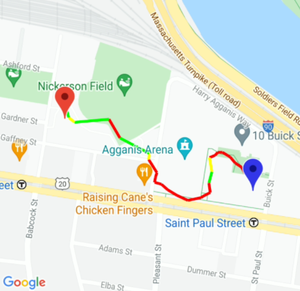

# Tempo Keeper

#### A Running App with custom routing and dynamic music playback functionalities

## Description
Tempo Keeper is an Android Native mobile running app written in Java with features catering towards competitive and casual
runners. It has customizable routing, where users can specify parameters such as destination,
distance, and elevation to create running routes that meet their needs. In addition to routing,
the app features a dynamic music playback functionality, which connects to the user's Spotify account
and dynamically and automatically queues/plays songs with tempos matching the user's live running pace.
Tempo Keeper allows runners to keep track of their past run history of routes and statistics,
motivating them to improve and excel in their running, whether it is a leisure or competitive activity.

## Spotify API
In order to enable the music features of this app, you must have a Spotify account (free or premium) 
and the Spotify app must be downloaded on the device.
The user's SHA-1 key must also be registered in the app on the Spotify Dashboard (https://developer.spotify.com/dashboard/applications).

For grading purposes, we have already added the grader's SHA-1 key so the app's Spotify features 
should already be functional.

## The App
In order to utilize Tempo Keeper, you must create an account and log into that account through
the launch login page. Once logged in, you will be directed to your profile page.

The top app menu bar has 3 menu items: the Create Route Form (leftmost), User Profile, and Sign Out
(rightmost).

## Activities

### Create Route Form
To create a running route, enter the desired destination (a real world address) and select an
elevation option (Hilly, Flat, or N/A). Selecting Hilly will find the route to that destination with
the most elevation changes, while selecting Flat or N/A will find the route with the least elevation
changes. Also, the user can enter an optional target distance in miles so that they will be
notified when they've reached that goal during the run. Click "Calculate Route" to see a preview
of the generated running routes.

### Route Preview
After completing the route form, this activity displays up to 3 generated routes to your destination.
The blue marker indicates your current/starting location, while the red marker indicates your
desired destination. Based on the elevation option chosen in the previous route form activity,
one of the routes are blue: if "Hilly" was selected, the route with the greatest elevation changes will
be blue, and if "Flat" or "N/A" was selected, the route with the least elevation changes will
be blue. The user has the freedom to select one of the other alternative routes to run by clicking on
the individual routes on the map. Clicking on a route will make it highlight it blue and give a Toast
notifying the user what the elevation along that route is like (e.g., "This route is the most hilly").
Once the desired route is blue, click the "Select Music" button.

### Playlist Selection
Before the running activity, the user is asked to select one of their Spotify playlists (owned or
following) by clicking "Load My Playlists Below" and clicking on a playlist in the recycler view to
continue. Once a playlist has been selected, click "Go to Run" to start the actual run. The tracks
from this playlist will be played during the dynamic music playback feature of the running activity.

### Running Activity
The running activity displays the generated route and tracks the user's current location along the run.
Click "Start" to start your run and the dynamic music playback. As you run, a pedometer running in the
background will keep track of your current pace in steps per minute. When your pace changes significantly
along the run, the dynamic song playback feature of this app will automatically play a new Spotify song
with a tempo matching your updated running pace. Changing tracks will automatically update the track information
and playback progress on the screen, as well as notify the user of the track change (and to what tempo) at the
bottom of the screen.

.png)
.png)

Also, if the user entered a target distance (miles) in the create route form previously, they will be
notified when they have reached that goal at the bottom of the screen.

When finished running, click "Finish" to end the run and stop the music. Then, click the "Stats" button
to go to the Run Statistics activity, where your run route on a map and running statistics such as
distance, duration, and average speed are displayed.

The map in Run Statistics will show a color-coded version of the route ran (like below), with red indicating slower
parts of your run and green indicating faster parts (demonstrates fluctuations in run speed).

Following Run Stats, you can click "View Profile" to see the updated list of runs in your run history.

### User Profile
The profile page displays the user's name, account email, and Spotify username, as well as a recycler view
of their past run history. Clicking on one of these runs in Run History will take you to a Past Route Preview
page, where you can see your route and stats. This preview page gives the user an option to rerun a past route:
clicking the "Rerun this Route" button takes you to the Playlist Selection activity again, so that you
can select a playlist and go to the Running activity to rerun the same route. This way, the user does not have
to fill out the create route form for routes that they frequently revisit.

Sometimes when coming back to the User Profile after a run (aka coming here from the Run Stats page),
the most recently added route image (topmost image) in the route history list will not generate on time.
This is the purpose of the Reload History button, where it will refresh the run history to properly display
any images that were not generated on time.

## Bonuses
- Proper request of device permissions for 5.1 and above
- Use of RecyclerView or CardView
- Good use of Menus
- Using Gestures and Accelerometer

## References
- Spotify API
  - https://developer.spotify.com/documentation/android/quick-start/
  - https://spotify.github.io/android-sdk/app-remote-lib/docs/com/spotify/android/appremote/api/PlayerApi.html
  - https://towardsdatascience.com/using-the-spotify-api-with-your-android-application-the-essentials-1a3c1bc36b9e
    
- Pedometer
  - https://github.com/bagilevi/android-pedometer

- Google Directions API
  - https://developers.google.com/maps/documentation/directions/overview
  - https://github.com/mitchtabian/Google-Maps-2018.git
  - https://github.com/trulymittal/LocationTutorial.git
  - https://www.journaldev.com/13373/android-google-map-drawing-route-two-points

- Google Elevation API
  - https://developers.google.com/maps/documentation/elevation/overview
    
- Color Coding Routes + Distance
  - https://www.geeksforgeeks.org/program-distance-two-points-earth/
    
## Contact Team Members
Elliot Cho echochs@bu.edu
Edward Choe edchoe00@bu.edu
Mark Nam marknam@bu.edu
Myka Kugaya mkugaya@bu.edu
